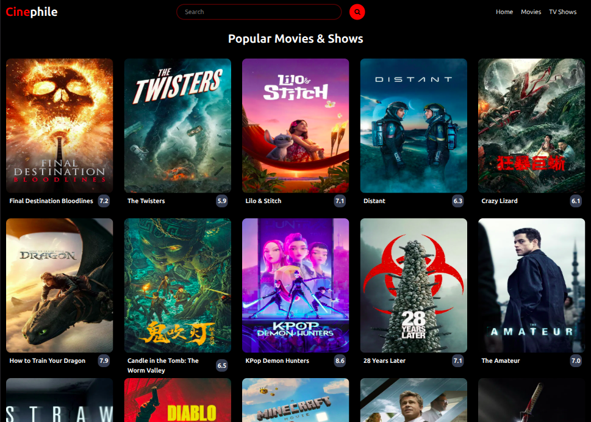
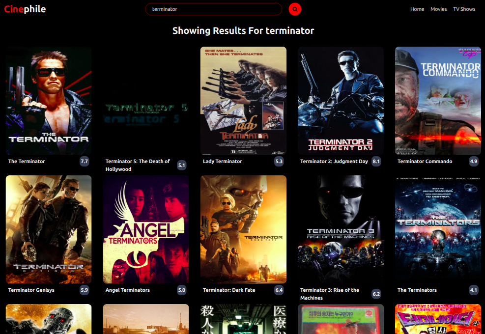
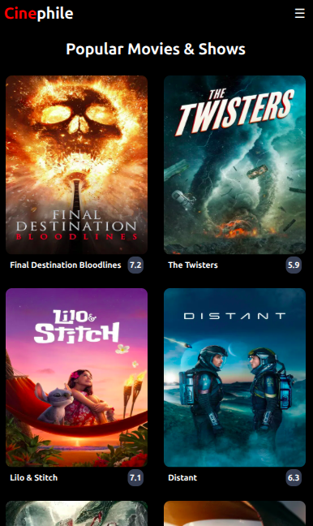
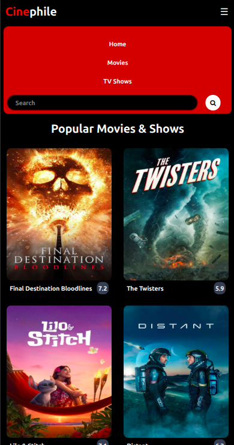

# 🎬 CinePhile
A minimal web project inspired by IMDb that allows users to view popular movies and search for movies, powered by The Movie Database (TMDB) API.

## 📖 Features
- View a list of popular movies and TV shows
- Search for movies using keywords
- Responsive design using Tailwind CSS
- Clean, simple user interface
- Hover to reveal movie overview and rating

## 🛠️ Tech Stack
- Vanilla JavaScript
- HTML5
- Tailwind CSS
- Vite for fast development
- TMDB API for movie data

## 📷 Screenshots
<div style="white-space: nowrap;">
  
  
</div>
For Mobile Devices:
<div style="white-space: nowrap;">
  
  
</div>


## 📦 Setup Instructions
1.Clone the repository

```
git clone <repository-url>
cd CinePhile
```

2.Install dependencies

```
npm install
npm install tailwindcss @tailwindcss/vite
```

3.Run the development server

```
npm run dev
```

4.Open in Browser

Visit: http://localhost:5173

## 🔑 API Key
This project uses The Movie Database API.
You need a free TMDB API key:

1.Sign up at TMDB.

2.Replace the API key in main.js:

```
const API_KEY = "api_key=YOUR_API_KEY_HERE";
```
